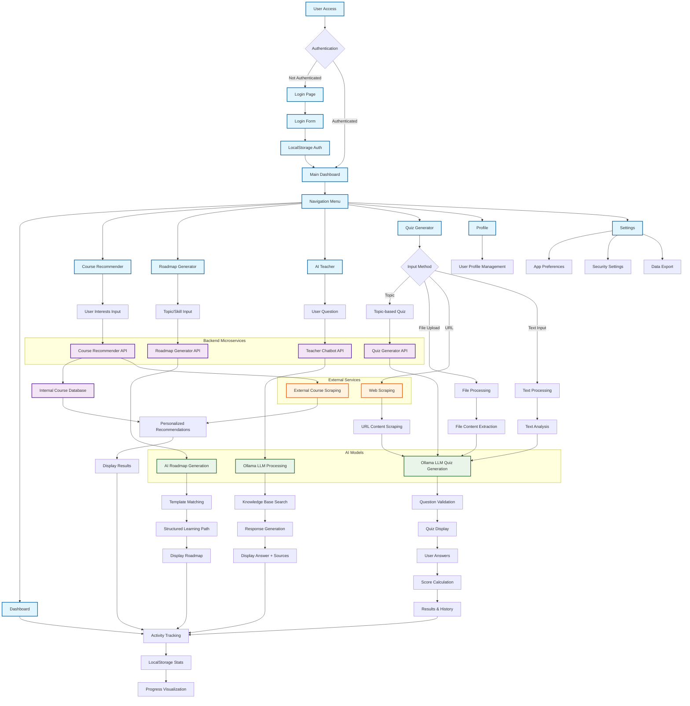

# AI Learning Platform - System Flow Chart

## 🔄 Complete System Flow

## 📋 Flow Description

### **1. Authentication Flow**
- User accesses the application
- System checks authentication status
- If not authenticated, redirects to login page
- After successful login, stores auth in localStorage
- Redirects to main dashboard

### **2. Main Navigation**
- Dashboard: Overview and progress tracking
- Course Recommender: Find relevant courses
- Roadmap Generator: Create learning paths
- AI Teacher: Get educational help
- Quiz Generator: Create and take assessments
- Profile: Manage user information
- Settings: Configure app preferences

### **3. Course Recommender Flow**
- User inputs interests or searches
- API processes request
- Combines internal database and external scraping
- Returns personalized recommendations
- Displays results to user

### **4. Roadmap Generator Flow**
- User selects topic or skill
- API generates learning roadmap
- Uses AI and template matching
- Creates structured learning path
- Displays roadmap to user

### **5. AI Teacher Flow**
- User asks educational question
- API processes with Ollama LLM
- Searches knowledge base
- Generates comprehensive response
- Displays answer with sources

### **6. Quiz Generator Flow**
- User chooses input method (topic/file/URL/text)
- System processes content accordingly
- Uses Ollama LLM to generate questions
- Validates question quality
- Displays interactive quiz
- Tracks user answers and calculates scores

### **7. Data Integration**
- All user activities feed into dashboard
- Activity tracking updates localStorage
- Progress visualization shows learning insights
- Real-time updates across components

## 🔧 Technical Architecture

### **Frontend (React + TypeScript)**
- Component-based architecture
- LocalStorage for state persistence
- Real-time event handling
- Responsive UI with Tailwind CSS

### **Backend (Flask Microservices)**
- Independent services on different ports
- RESTful API design
- JSON data exchange
- File-based storage

### **AI Integration**
- Ollama LLM for natural language processing
- Content analysis for recommendations
- Template-based generation for roadmaps
- Multi-modal input processing

### **External Services**
- Web scraping for course discovery
- URL content extraction for quizzes
- Knowledge base integration for AI teacher 